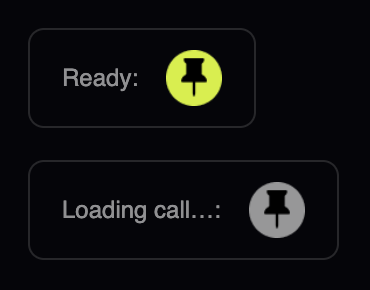
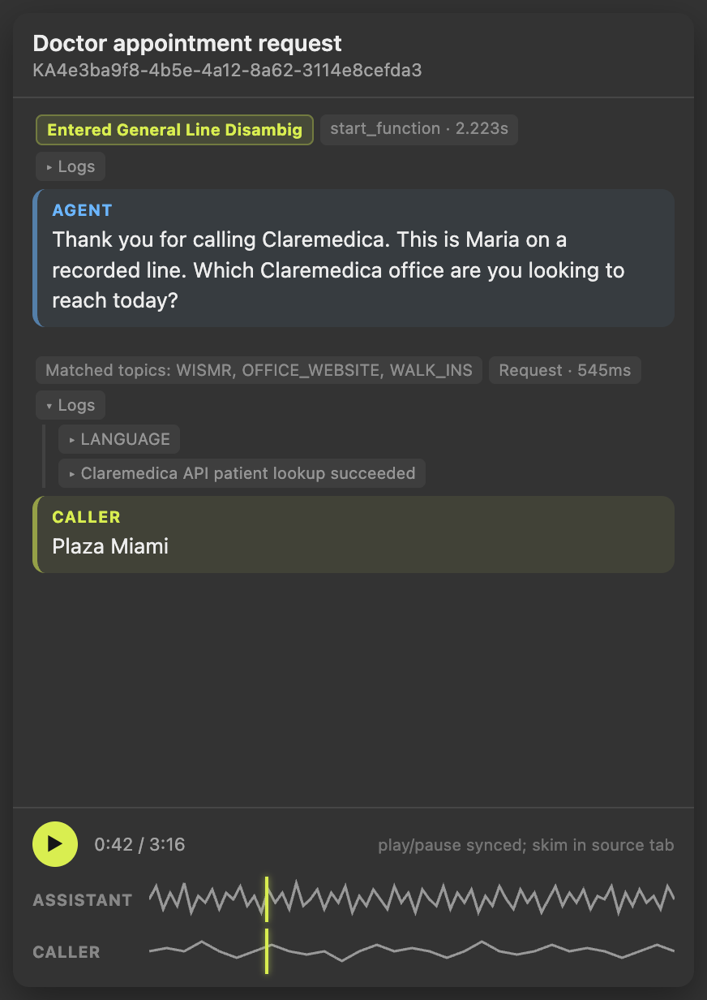
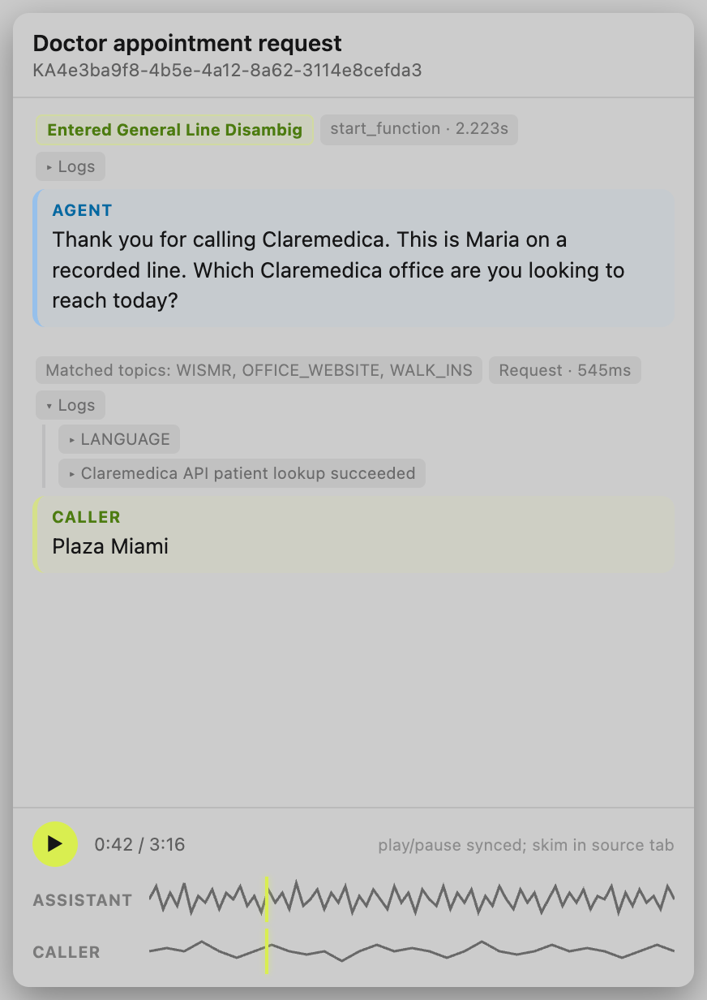

#  PolyPin

A Chrome extension that pops a PolyAI Agent Studio conversation's transcript and audio out into a floating, always-on-top window — so you can keep a call visible while you work in another tab, another app, or another monitor entirely.

## Features

### Pop Out Any Conversation

A small pin button appears in the conversation header's icon cluster (next to Notes, PolyTranslate, etc.) — or in the notes toolbar when viewing a call from the drawer/sidebar. It greys out and pulses while the call is still loading, and turns solid once ready to click.

> <p align="center">
>   
> </p>

Click it to pop the conversation into a real OS-level floating window — built with the browser's native [Picture-in-Picture API](https://developer.chrome.com/docs/web-platform/document-picture-in-picture), not an iframe or a copy of the tab. It stays on top of other windows, keeps its own size and position, and works independently of the Studio tab underneath.

### Live Transcript + Synced Audio

The floating window shows the full transcript, color-coded by speaker, along with the same audio player Studio has — play/pause and position stay in sync with the source tab (skip around by using the source tab's own controls; the floating window mirrors it, rather than running a second copy of the audio).

> <p align="center">
>   
>   
> </p>

### Debug Info, Mirrored Live

Whatever you've got checked in Studio's own **Debug options** menu (Variables, Flows and steps, Tool calls, Logs, Matched topics, and so on) shows up right alongside the transcript — check or uncheck something in Studio and the floating window updates within a second, no need to reopen it. Flow milestones ("Entered X," "Exited X") get their own highlighted styling so they stand out from the rest of the debug noise.

Logs and Variables both get special treatment: they're real, individually-expandable dropdowns in the floating window too, not just a flat summary line. Click one and it expands the real thing back on the source page and mirrors the result — for Logs, all the way down to a log entry's own raw detail payload; for Variables, the full list of conversation variable names and values.

### Follows the Conversation

Click **Next**/**Prev**, or switch calls in a sidebar list, and the floating window updates in place to match — no need to close and reopen it. Leave the conversation entirely (back to a call list, or off Studio altogether) and it closes on its own.

### Matches Studio's Theme

The floating window's colors follow whichever of Studio's light/dark themes you're currently using, and switch live if you change it while the window is open.

## Installation

There's no build step — this is loaded straight from source.

1. Clone the repository:

   ```bash
   git clone https://github.com/PatrickSwanson-Poly/PolyPin.git
   ```

2. In Chrome, go to `chrome://extensions` (paste that into the address bar).
3. Turn on **Developer mode** (top-right toggle).
4. Click **Load unpacked** and select the `PolyPin` folder you just cloned.
5. Open any voice call conversation in [studio.us.poly.ai](https://studio.us.poly.ai/) (or another `*.poly.ai`/`*.polyai.app` deployment) and look for the pin icon.

## Updating

```bash
git pull
```

Then reload the card on `chrome://extensions` and refresh any open Studio tabs — Chrome doesn't hot-reload content scripts.

## How It Works

PolyPin is a single content script (`content.js`) injected directly into the Studio page — there's no background/service worker and no separate popup UI. At a high level:

1. A `MutationObserver` plus a couple of lightweight polling loops keep the trigger button correctly anchored in Studio's own header as the page re-renders around it, and keep it disabled until the conversation (and, for voice calls, its audio player) has actually finished loading.
2. Clicking the button scrapes the current conversation's turns and debug annotations directly out of the live DOM and opens a `documentPictureInPicture` window — this has to happen synchronously in the click itself, since the browser requires a real user gesture it won't forward across any kind of delay.
3. The floating window doesn't duplicate the audio — it remote-controls the real player in the source tab (clicking its real play/pause button, reading its real position) and polls for changes, since Studio's own React re-renders can replace the elements involved out from under a naive one-time listener.
4. Everything else (navigation between calls, debug-options toggles, theme changes, Logs/Variables expand/collapse) is kept in sync the same way: short polling loops re-check the live page and only touch the floating window when something's actually different, rather than assuming any one event always fires reliably.

## File Structure

```
PolyPin/
  manifest.json    # Extension manifest (MV3)
  content.js       # Everything — scraping, the PiP window, button injection, sync
  content.css      # Styles for the trigger button on Studio's own page
  pip.css          # Styles for the floating window's own content
  icons/
    icon16.png / icon48.png / icon128.png
```

## Limitations

- **One PiP window per browser, not just per tab.** This is a platform limitation, not a PolyPin bug — `documentPictureInPicture` is a single global window shared across your whole browser. Opening PolyPin's floating window will close any other app's floating window that happens to be open (Google Meet's floating video tile, for example), and vice versa.
- **The floating window closes if its source tab closes**, or if that tab navigates away from the conversation entirely. The source tab needs to stay open (it can be backgrounded) for the floating window to keep working.
- **No seeking from the floating window.** Play/pause stays in sync, but clicking around on the waveform is display-only — Studio's own playback position can't be driven from outside its own page.
- **Scraping is inherently a little fragile.** PolyPin reads Studio's live DOM directly rather than through any official API, so an unrelated redesign on Studio's end could break something here. This is an accepted tradeoff of the approach, not something a config option can fix.

## Author

**Patrick Swanson** — PolyAI
